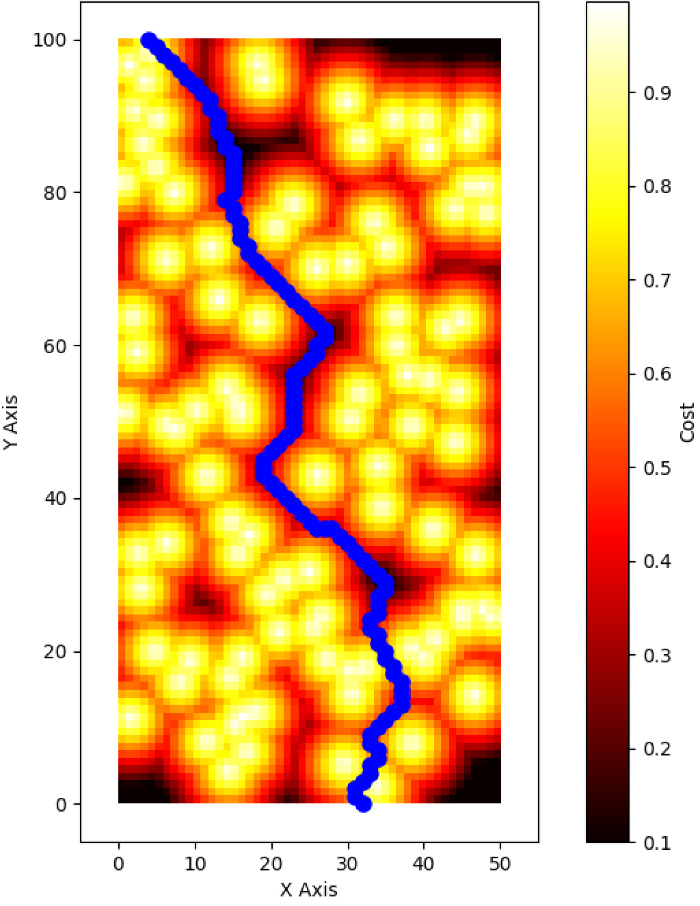
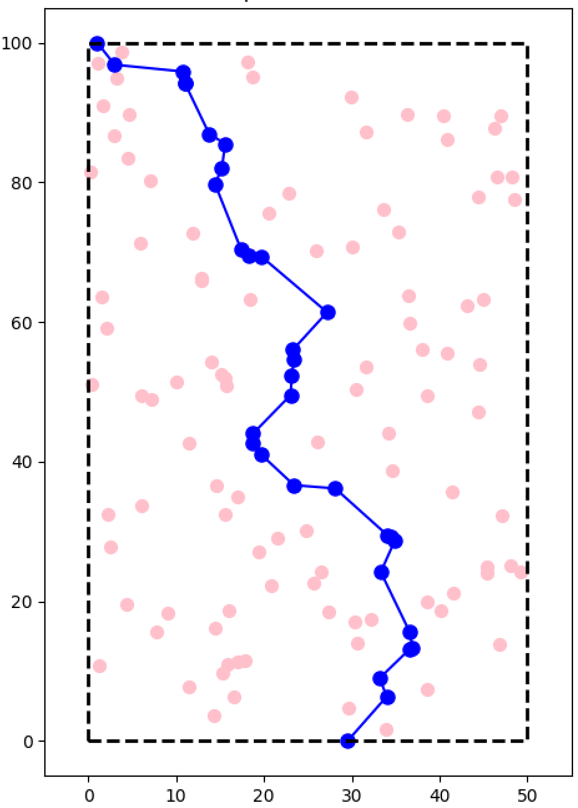

# Rumo_vs_Cows
This is a little project of mine to solve the problem of finding the shortest path from A to B with the least risk of intervention.

| Image 1 | Image 2 |
|--------|---------|
|  |  |
| Discrete solution | Voronoi solution |

There are two different algorithms:

1. `discrete`: Here we build a NxN grid mesh to solve the path of least resistance in a discrete way. It is very compute intense but the benefit is
the accuracy of walking around the cows.

2. `voronoi`: This approach computes first the Voronoi points and uses those to to build a graph. This one is much fast but with the cost of only
being able to walk across the ridges of the Voronoi points (i.e. less finer paths).
