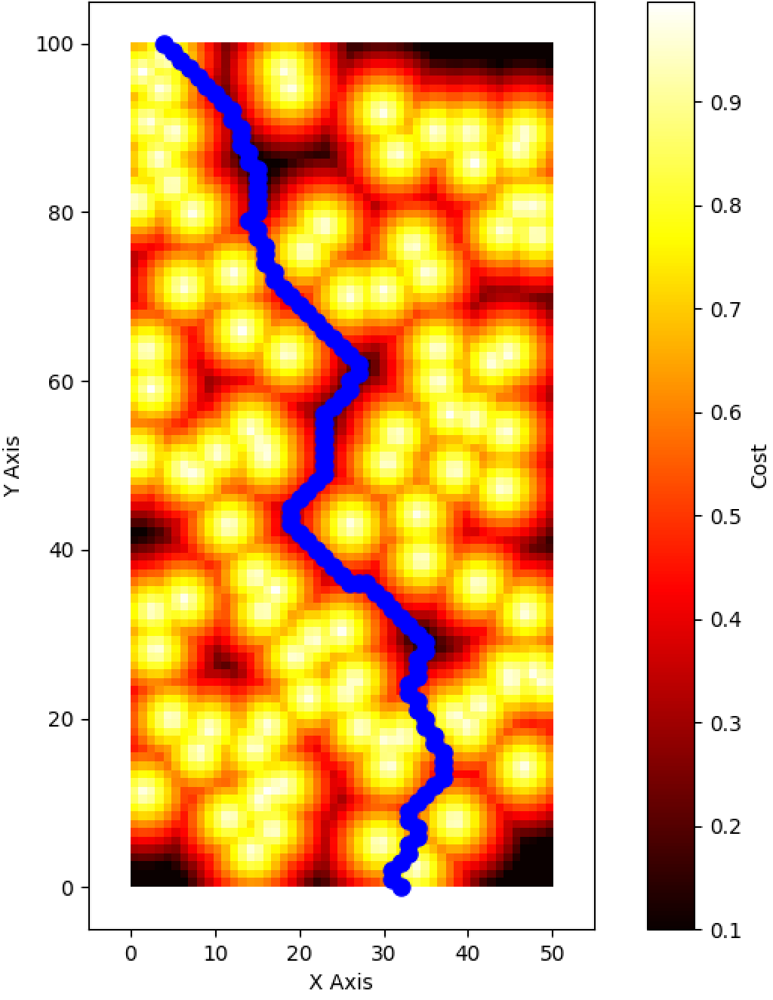
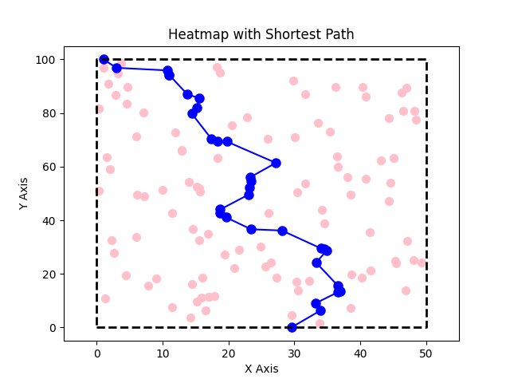

# Rumo vs. Cows

A little project of mine: Rumo the dog has to cross a field full of cows. Whenever he gets too close to one, he starts barking — so the plain shortest path won't do. We are looking for the **path of least resistance**: the way from A to B that keeps Rumo as far away from the herd as possible.

I made a video about it for the Summer of Math Exposition (#SoME4), walking through all three algorithms below:

[](https://www.youtube.com/watch?v=2odICIWldGE&t=2s)

**▶ Watch: [How to Cross a Field of Cows… Safely (using Math)](https://www.youtube.com/watch?v=2odICIWldGE&t=2s)**

## The three algorithms

### 1. `discrete` — brute force on a grid

Lay a fine grid over the field and compute a danger heatmap: the closer a grid point is to a cow, the more it costs to step on it. Connect every node to its 8 neighbours, turn the node costs into edge weights and let Dijkstra find the cheapest path. Very accurate — Rumo can walk around each cow at exactly the right distance — but the graph grows with the *area* of the field rather than the number of cows: at the same herd density it needs about 50× more nodes than the Voronoi variants.

### 2. `voronoi` — let geometry do the work

The safest walkways lie exactly *between* the cows, and that is precisely the Voronoi diagram of the herd. So: compute the Voronoi diagram (the herd is mirrored across the field boundaries so the ridges end nicely on the edges of the field), weight every ridge by integrating the danger along it (Simpson's rule), and run Dijkstra on this much smaller graph. Runs in O(n log n) in the number of cows. The paths are restricted to the Voronoi ridges — but those were the safe walkways anyway.

### 3. `voronoi_union` — Union-Find instead of Dijkstra

Same Voronoi ridges, different question: instead of the cheapest path we look for the path that maximizes the distance to the nearest cow along the way (no matter how long it gets). Sort all ridges by their clearance, insert them — safest first — into a Union-Find structure until start and end become connected, then extract a path with a DFS. Thanks to path compression and union by rank, each Union-Find operation runs in amortized O(α(n)) — the inverse Ackermann function, i.e. effectively constant time.

| Discrete solution | Voronoi solution |
|-------------------|------------------|
|  |  |

## Benchmarks

Average runtime over 9 seeds. The field grows with the herd, keeping the density constant at one cow per 100 m²:

| # cows | `discrete` | `voronoi` | `voronoi_union` |
|-------:|-----------:|----------:|----------------:|
| 10     | 0.002 s    | 0.006 s   | 0.002 s         |
| 50     | 0.006 s    | 0.031 s   | 0.006 s         |
| 100    | 0.010 s    | 0.039 s   | 0.010 s         |
| 200    | 0.020 s    | 0.075 s   | 0.021 s         |
| 400    | 0.043 s    | 0.148 s   | 0.051 s         |
| 700    | 0.087 s    | 0.417 s   | 0.076 s         |

> **Note:** the video shows the benchmarks of the original implementation, where `discrete`
> built a dense adjacency matrix and computed the heatmap in pure Python loops — taking 93 s
> (and 13 GB of RAM) at 400 cows. The code has since been vectorized and switched to sparse
> graphs, which makes all three approaches fast. `discrete` still pushes around ~50× more
> graph nodes than the Voronoi variants (70 225 vs. 1 402 at 700 cows), while `voronoi` now
> mostly pays for numerically integrating the danger along every ridge.

Reproduce with `./benchmark.sh` (results land in `benchmark_results.txt`).

## Running it

```bash
pip install numpy scipy matplotlib

python discrete/main.py             # default field: 50 m × 100 m with 100 cows
python voronoi/main.py 500 42       # <n_cows> <seed> — square field, constant cow density
python voronoi_union/main.py 500 42
```

Each script prints `<runtime in s> <number of graph nodes>`. To see the field and the computed path, set `plot = True` in the `main()` of the respective script.

## Animations

The `anim_*.py` files contain the [Manim](https://www.manim.community/) scenes used in the video. Each file holds a single scene; render it from inside the respective folder (the scenes import from the local `main.py`):

```bash
pip install manim pandas
cd voronoi_union
manim -pqh anim_2dfield.py
```
